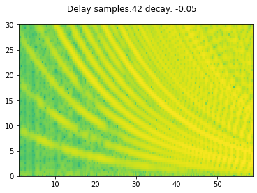

# Generative models for DOs

## Overview
Dynamic oscillations (DOs) are evoked in certain cases of DBS within the SCC [[tiruvadi2022]]().

## Models

### Delay Circuit
A simple delay circuit generates a comb filter.
A time-varying delay in the delay circuit can shape the DO.

### Wilson-Cowan Network
A simple Wilson-Cowan network with edge dropout generating DOs.
Based on work outlined in Liangyu Tao's [dissertation](https://smartech.gatech.edu/bitstream/handle/1853/60876/TAO-UNDERGRADUATERESEARCHOPTIONTHESIS-2017.pdf?sequence=1)

Related Repositories:
* 
* 

### Wilson-Cowan with Delay
WC network model with addition of delays, implemented as an edges with delays in downstream effects.

### Wilson-Cowan with Depletion
WC network model with addition of depletion, implemented as an edge that decays as a function of high-frequency stimulation.
